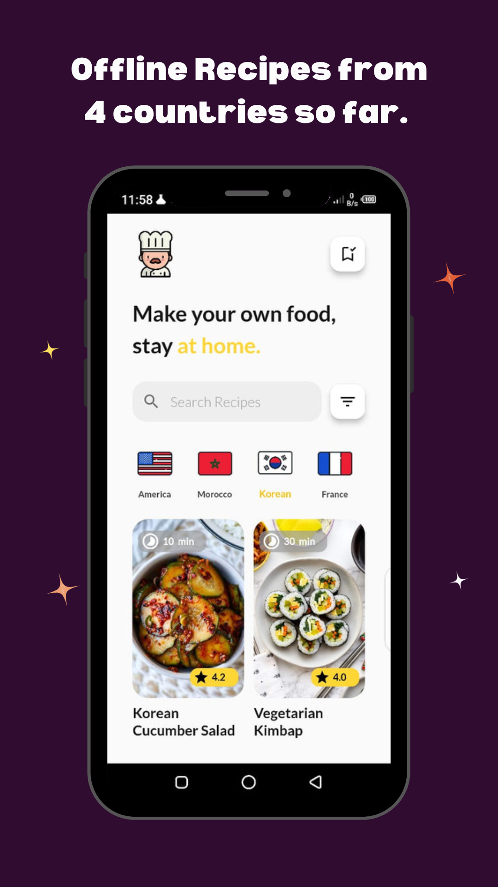
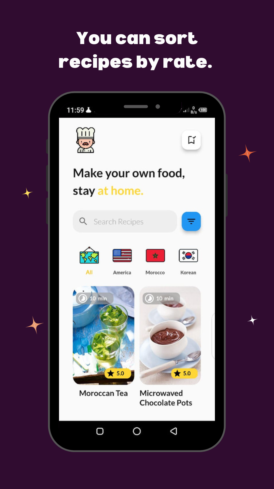
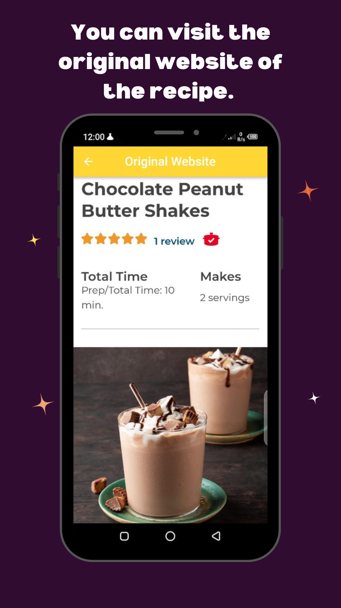

# 🔥 International Recipes App

An App for offline recipes from all over the world (4 countries so far), built with BLoC State managment Library and Hive Database.

Star⭐ the repo if you like what you see😉.

## ✨ Features :
- Search for recipes.
- Sort recipes in an ascending order.
- Visit the original website of the recipe with Flutter WebView.
- Add/Remove/Retrieve Recipes Offline with Flutter Hive.
- Beautiful UI.

## 📸 Screenshots :

  
  

**=> The Baker icon is from [FlatIcon](<a href="https://www.flaticon.com/free-icons/chef" title="chef icons">Chef icons created by Freepik - Flaticon</a>/)**

**=> The Flags icons are from [FlatIcon](https://www.flaticon.com/packs/flags-collection)**

**=> The UI is inspired from [Behance](https://www.behance.net/gallery/96301779/Mobile-App-Food-Recipe-Application)**

